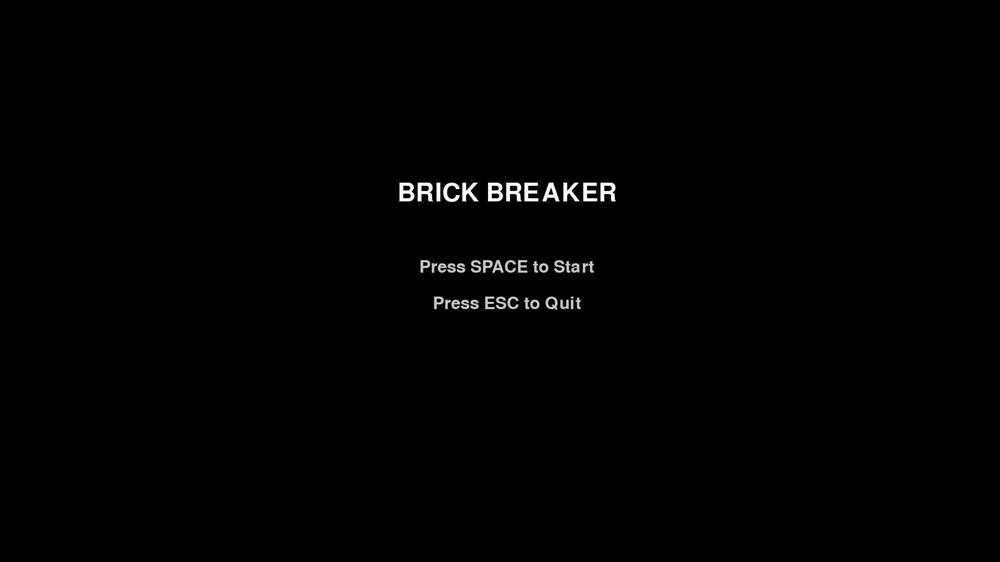
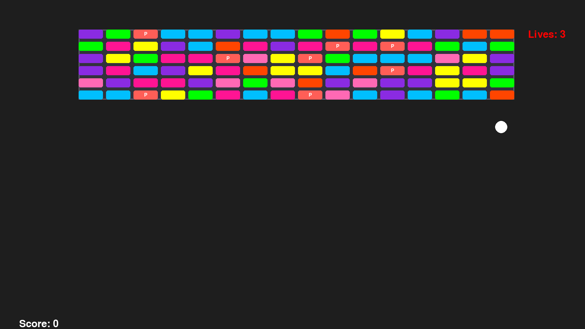

# 🎮 Brick Breaker Game (Pygame)

A classic arcade-style **Breakout** game built using **Python** and **Pygame**, enhanced with powerups, sound effects, and a modern fullscreen experience.

## 🚀 Features

- 🎯 Smooth paddle and ball physics
- 💥 Powerups (Extra Life, Speeddown, Extra Balls, Dash)
- 🔊 Sound effects and background music
- 🧱 Dynamic brick layout
- 🕹️ Fullscreen gameplay with clean UI
- 🧠 Modular code split into `paddle.py`, `ball.py`, `brick.py`

---

## 🕹️ Gameplay

Control the paddle to bounce the ball and destroy all the bricks! Watch out for falling balls, grab powerups, and survive as long as you can.

### Powerups:
- 🧡 **Extra Life** – Adds 1 life.
- 🐢 **Speeddown** – Slows down ball speed for a short time.
- 🏐 **Extra Balls** – Spawns additional balls.
- ⚡ **Dash** – Temporarily speeds up the ball.

---

## 🎮 Controls

| Key        | Action              |
|------------|---------------------|
| ← / →      | Move paddle         |
| SPACE      | Launch ball         |
| ESC        | Quit game           |

---

## 🧑‍💻 Requirements

- Python 3.8+
- Pygame 2.x

Install dependencies:

```bash
pip install pygame
```

## 📁 Project Structure
```
project/
│
├── main.py             # Main game loop
├── paddle.py           # Paddle class
├── ball.py             # Ball class
├── brick.py            # Bricks and layout logic
├── requirement.txt
├── assets/             # Sound and music files
│   ├── pong1.wav
│   ├── pong2.wav
│   ├── pong3.wav
│   ├── power-up.wav
│   ├── bg1.mp3
│   └── bg2.mp3
│   └── bg3.mp3
└── README.md           # This file
```

## 🧠 How It Works

    Uses pygame.Rect for collision detection

    Ball velocity adjusts based on paddle collision

    Bricks randomly spawn powerups on destruction

    Game state resets after Win or Game Over

## 🏆 Credits

Made with 💻 by Anas Arfeen

Feel free to fork, modify, or contribute!

## 📸 Screenshot



---
