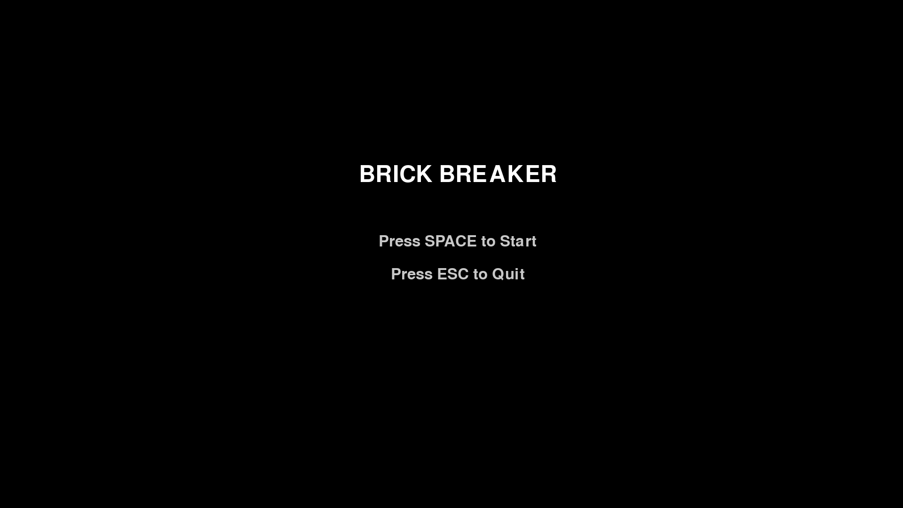
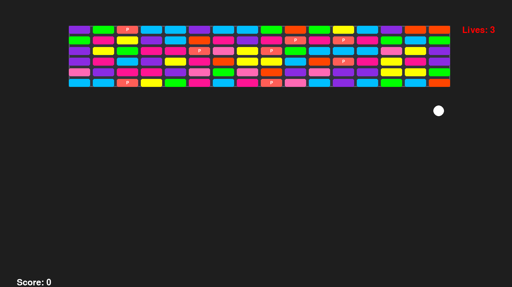

# 🕹️ Breakout: Arcade Revival

A high-energy, modern take on the classic Breakout arcade game, developed in Python using the Pygame library. This implementation features responsive controls, randomized power-ups, and a multi-track audio system that scales with gameplay.


---

## ✨ Features

- **Dynamic Physics**: Smooth ball-to-paddle and ball-to-brick collision logic.
- **Power-up System**: Unique items that drop from destroyed bricks to change gameplay dynamics.
- **Adaptive Audio**: Includes multiple background tracks (`bg1`, `bg2`, `bg3`) and distinct sound effects for collisions and power-ups.
- **Clean UI**: Modern, minimalist graphics with a clear scoring system.

---

## 🎮 How to Play

- **Move Paddle**: Use the `Left` and `Right` arrow keys to move the paddle.
- **Objective**: Destroy all bricks on the screen without letting the ball fall below the paddle.
- **Power-ups**: Catch falling icons to gain temporary advantages.

---

## 🛠️ Installation

### Prerequisites

- Python 3.10+
- Pygame

### Setup

1. Clone the repository:

   ```bash
   git clone https://github.com/anasarfeen123/breakout.git
    ```

2. Install dependencies:

    ```bash
    pip install -r requirement.txt
    ```

3. Run the game:

    ```bash
    python main.py
    ```

---

## 📁 Project Structure

```
project/
│
├── main.py             # Main game loop
├── paddle.py           # Paddle class
├── ball.py             # Ball class
├── brick.py            # Bricks and layout logic
├── requirement.txt
├── assets/             # Sound and music files
│   ├── pong1.wav
│   ├── pong2.wav
│   ├── pong3.wav
│   ├── power-up.wav
│   ├── bg1.mp3
│   └── bg2.mp3
│   └── bg3.mp3
└── README.md           # This file
```

---

## 🧠 How It Works

- Uses pygame.Rect for collision detection

- Ball velocity adjusts based on paddle collision

- Bricks randomly spawn powerups on destruction

- Game state resets after Win or Game Over

---

## 📸 Screenshot




---

## 🏆 Credits

Made with 💻 by Anas Arfeen

Feel free to fork, modify, or contribute!


---
Developed by **Anas Arfeen!**
